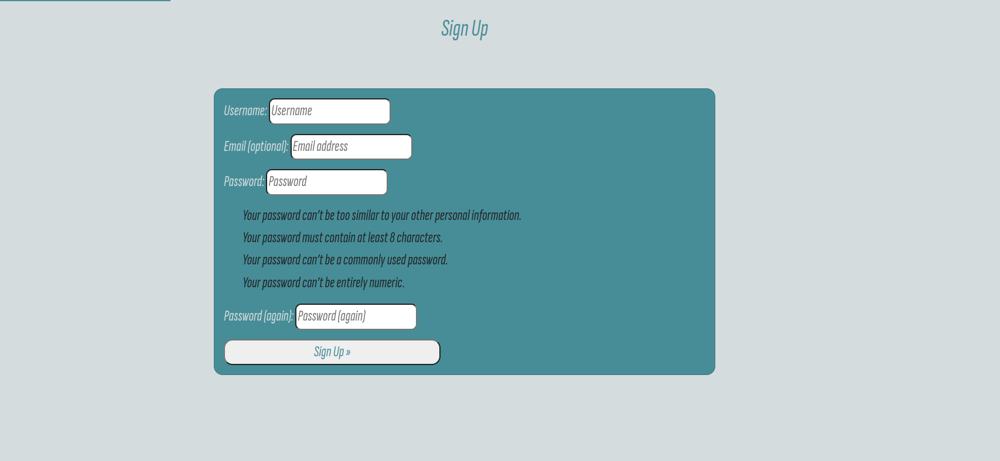

# Luna discussion forum

## Deployment

* site is live at : https://portfolio-4-1ef2f7260848.herokuapp.com/
* To enter admin panel go to -> https://portfolio-4-1ef2f7260848.herokuapp.com/admin

### clone repository locally (HTTPS)

* Navigate to the repository (https://github.com/CamillaTH/portfolio-2)
* Click on the button "code".
* Choose "HTTPS" and copy the URL.
* Choose a local directory where want to clone the repository.
* Open terminal at the location you want the repository and write "git clone https://github.com/CamillaTH/portfolio-2.git" and press enter.

### Run Website locally

To run server locally from terminal write :
 * python3 manage.py runserver
 * open in browser (click yes)
 
#### Activate local database
To use the local databse in settings.py line : 104-115 uncomment below "# local Database" 
* DATABASES = {
    'default': {
       'ENGINE': 'django.db.backends.sqlite3',
        'NAME': BASE_DIR / 'db.sqlite3',
    }
}

And comment out 
#production DB
* DATABASES = {
     'default': dj_database_url.parse(os.environ.get("DATABASE_URL"))
 }
 
## Agile

Agile development was used during development of this site project board can be found :
* https://github.com/users/CamillaTH/projects/4/views/1

## Frameworks

* This application is using the python frameWork Django v3.2.21
* Db is a postgresSql hosted on elephantsql.com
* Site is deployed at heroku.com
* jQuery is used as JS framwork
* Boostrap is used as HTML/css framwork

## Features 

### Exsiting Features
 
* User can create an account.
* Users can sign in and sign out.
* Users can create posts.
* Users can like posts.
* Users can add comments on posts.
* A Post needs to be approved by admin before its published.
* A Comment needs to be approved by admin before its published.
* Users can like comments.
* Users can add/change profile picture.
* Admin can create new categories.
* Admin can add a image to an category.
* Admin can add a category to a post.
 
 __ADMIN PANEL__

 
 __HOMEPAGE__

Homepage with categoires to 

__POSTDETAIL__

On the postdetailpage the user can view the post and like the post, if the user clicks the like button again the post is unliked.

__POSTDETAIL COMMENT__

On the post detailpage there is a comment section where user can add comments with content and image. Users can like comments if the user clicks the like button again the comment is unliked. The profile picture of the user is also dispalyed by each users comment.

__LOGIN PAGE__

Loginpage using allAuth framwork, defualt allauth template is modified for custom need. To navigate to login page user clicks in "login" in the navbar in the header. 

__LOGIN PAGE__

Signup page using allAuth framwork, defualt allauth template is modified for custom need. To navigate to signup page user clicks in "sign up" in the navbar in the header. 

__PRFOILE PAGE__

Profile page where user can add/change thier profile picture. The form is using the framwork crispy forms.

### Not implemented Features 
 There are some features that i planned but did not have time to implement.
 * search for post, be able to search for post in the searchbar in the header.
 * sort posts by categories, by clicking on each categoires in the top left of the header the cateogires should be filtered out. 

## Testing
 
 * To run python test in terminal write: "python manage.py test"
 
### Python test results

### Lighthouse score 

### Responsvie testing 
    Of some reason it does not work with Heroku apps and responsive checker (i tested different ones just got a blank screen...)

### Bugs

Bugs that are confimred and not fixed:
* When creating a post when adding category to the post it is not saved..(admin have to add category to a post from admin panel)
* Instead of showing category names when creating a post "Category objecy [0], Category objecy [1] etc" is shown instead.
* When adding a image to a comment the image is not saved (a todo is in the code for that (get strange errors when i tried to fix it))

## Credits 

Inspiration taken from code insitutes rock papper scissors game made by code insitute.

* For blinking effect this guide was used
https://www.w3docs.com/snippets/css/how-to-create-a-blinking-effect-with-css3-animations.html
* For to convert an png image to favicon (.ico format) 
https://cloudconvert.com/ico-converter tool was used.
* to create the logo i used adobe https://www.adobe.com/express/create/logo
* To make images transparent https://www.remove.bg/ tool was used

